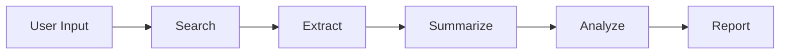
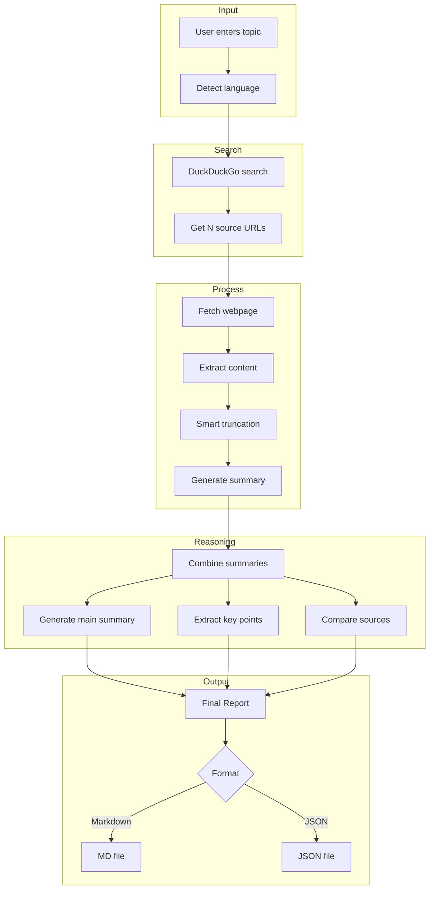

# Research AI Assistant

A multi-step intelligent research agent that helps users get comprehensive, structured summaries on any topic with citations.

## Features

- **Multi-language Support**: Enter topics in any language (English, Persian, Japanese, etc.) - output matches input language
- **Multi-step Reasoning**: Search → Extract → Summarize → Analyze → Generate Report
- **Structured Output**: JSON or Markdown with citations
- **Smart Truncation**: Preserves intro and conclusion when processing long content
- **Configurable**: Adjust number of sources, select AI model

## Architecture

```
src/
├── features/research/
│   ├── domain/           # Models, interfaces, exceptions
│   ├── infrastructure/   # Search, extraction, summarization, report generation
│   ├── presentation/     # Streamlit UI
│   └── services/         # Business logic orchestration
└── shared/               # Config, utilities, base classes
```

## Tech Stack

- **LLM**: OpenAI GPT-4 (via LangChain)
- **Search**: DuckDuckGo (no API key required)
- **Content Extraction**: Trafilatura
- **Language Detection**: langdetect
- **UI**: Streamlit
- **Testing**: pytest + Hypothesis (property-based)

## Flow



### Detailed Pipeline



## Installation

```bash
# Clone the repository
git clone <repo-url>
cd research-ai-assistant

# Install dependencies
pip install -r requirements.txt

# Set up environment
cp .env.example .env
# Edit .env and add your OPENAI_API_KEY
```

## Usage

### Streamlit UI (Recommended)

```bash
python run.py
```

Open http://localhost:8501 in your browser.

### FastAPI Server

```bash
python run.py --api
```

API available at http://localhost:8000

## Configuration

Click the ⚙️ icon in the UI to configure:
- **Number of Sources**: 3-10 (default: 5)
- **Model**: gpt-4o or gpt-4o-mini

## Output Format

### Markdown
```markdown
# Summary
Comprehensive overview with [1] citations...

# Key Points
• Point one [1]
• Point two [2]
...

# Comparison
Analysis of source agreements/disagreements...

# Citations
[1] Title - URL
[2] Title - URL
```

### JSON
```json
{
  "summary": "...",
  "key_points": ["...", "..."],
  "comparison": "...",
  "citations": [
    {"number": 1, "title": "...", "url": "..."}
  ],
  "language": "en"
}
```

## Testing

```bash
# Run all tests
pytest tests/ -v

# Run with coverage
pytest tests/ --cov=src
```

## Project Structure

| Directory | Purpose |
|-----------|---------|
| `src/features/research/domain/` | Domain models, interfaces (Protocol), exceptions |
| `src/features/research/infrastructure/` | External integrations (OpenAI, DuckDuckGo, Trafilatura) |
| `src/features/research/services/` | Business logic, orchestration |
| `src/features/research/presentation/` | Streamlit UI |
| `src/shared/` | Shared config, utilities |
| `tests/` | Property-based tests with Hypothesis |

## License

MIT

## Assumptions & Design Decisions

| Category | Assumption | Value |
|----------|------------|-------|
| **Sources** | Default number of sources | 5 |
| | Min/Max sources | 3-10 |
| **Content** | Max content per source | 8,000 chars (~2k tokens) |
| | Fetch timeout | 30 seconds |
| | Max topic length | 500 chars |
| **LLM** | Default model | gpt-4o-mini |
| | Temperature | 0.3 (focused, less creative) |
| | Summary max tokens | 500 |
| **Report** | Key points count | 5-7 |
| | Summary length | 2-3 paragraphs |
| | Comparison length | 1-2 paragraphs |
| **Language** | Detection | Auto-detect from input |
| | Default fallback | English |
| **Search** | Provider | DuckDuckGo |

## Key Design Decisions

### Why Layered Architecture?
The project uses Domain-Driven Design with clear separation:
- **Domain Layer**: Pure business logic, no external dependencies
- **Infrastructure Layer**: All external integrations (OpenAI, DuckDuckGo, etc.)
- **Service Layer**: Orchestrates the workflow
- **Presentation Layer**: UI concerns only

This makes the code testable, maintainable, and allows swapping implementations (e.g., replace DuckDuckGo with SerpAPI) without changing business logic.

### Why Protocol-based Interfaces?
Using Python's `Protocol` instead of abstract base classes allows structural subtyping. Any class with matching methods works - no inheritance required. This enables easier testing with mocks.

### Why Property-based Testing?
Instead of example-based tests, we use Hypothesis to generate hundreds of random inputs. This catches edge cases that manual tests miss (e.g., Unicode handling, empty strings, special characters).

### Why DuckDuckGo over SerpAPI?
- No API key required (easier setup)
- Free and unlimited
- Sufficient quality for research purposes

### Why Smart Truncation?
Long articles exceed LLM context limits. Instead of simple truncation (cutting at N characters), we preserve the introduction and conclusion - the most informative parts of most articles.

### Why Multi-step Reasoning?
Single-prompt summarization loses nuance. Our pipeline:
1. Summarize each source independently (preserves source-specific details)
2. Generate unified summary (synthesizes across sources)
3. Extract key points (structured insights)
4. Compare sources (identifies agreements/disagreements)

This produces richer, more accurate reports than single-shot generation.

## Development Time

Total time: **~8 hours**

| Core Implementation | 5 hours | Architecture design, search/extraction/summarization pipeline, LangChain integration, Streamlit UI, property-based tests |
| Refinement | 3 hours | Error handling, settings UI, code refactoring, documentation |
