# Research AI Assistant

A multi-step intelligent research agent that helps users get comprehensive, structured summaries on any topic with citations.

## Features

- **Multi-language Support**: Enter topics in any language (English, Persian, Japanese, etc.) - output matches input language
- **Multi-step Reasoning**: Search → Extract → Summarize → Analyze → Generate Report
- **Structured Output**: JSON or Markdown with citations
- **Smart Truncation**: Preserves intro and conclusion when processing long content
- **Configurable**: Adjust number of sources, select AI model

## Architecture

```
src/
├── features/research/
│   ├── domain/           # Models, interfaces, exceptions
│   ├── infrastructure/   # Search, extraction, summarization, report generation
│   ├── presentation/     # Streamlit UI
│   └── services/         # Business logic orchestration
└── shared/               # Config, utilities, base classes
```

## Tech Stack

- **LLM**: OpenAI GPT-4 (via LangChain)
- **Search**: DuckDuckGo (no API key required)
- **Content Extraction**: Trafilatura
- **Language Detection**: langdetect
- **UI**: Streamlit
- **Testing**: pytest + Hypothesis (property-based)

## Flow

```mermaid
flowchart LR
    A[👤 User Input] --> B[🔍 Search<br/>DuckDuckGo]
    B --> C[📄 Extract<br/>Trafilatura]
    C --> D[📝 Summarize<br/>OpenAI]
    D --> E[🧠 Analyze<br/>LangChain]
    E --> F[📊 Report<br/>JSON/Markdown]
```



### Detailed Pipeline

```mermaid
flowchart TB
    subgraph Input
        A[User enters topic] --> B[Detect language]
    end
    
    subgraph Search
        B --> C[DuckDuckGo search]
        C --> D[Get N source URLs]
    end
    
    subgraph Process["Process Each Source"]
        D --> E[Fetch webpage]
        E --> F[Extract content]
        F --> G[Smart truncation]
        G --> H[Generate summary]
    end
    
    subgraph Reasoning["Multi-step Reasoning"]
        H --> I[Combine summaries]
        I --> J[Generate main summary]
        I --> K[Extract key points]
        I --> L[Compare sources]
    end
    
    subgraph Output
        J --> M[Final Report]
        K --> M
        L --> M
        M --> N{Format?}
        N -->|Markdown| O[📄 .md file]
        N -->|JSON| P[📋 .json file]
    end
```



## Installation

```bash
# Clone the repository
git clone <repo-url>
cd research-ai-assistant

# Install dependencies
pip install -r requirements.txt

# Set up environment
cp .env.example .env
# Edit .env and add your OPENAI_API_KEY
```

## Usage

### Streamlit UI (Recommended)

```bash
python run.py
```

Open http://localhost:8501 in your browser.

### FastAPI Server

```bash
python run.py --api
```

API available at http://localhost:8000

## Configuration

Click the ⚙️ icon in the UI to configure:
- **Number of Sources**: 3-10 (default: 5)
- **Model**: gpt-4o or gpt-4o-mini

## Output Format

### Markdown
```markdown
# Summary
Comprehensive overview with [1] citations...

# Key Points
• Point one [1]
• Point two [2]
...

# Comparison
Analysis of source agreements/disagreements...

# Citations
[1] Title - URL
[2] Title - URL
```

### JSON
```json
{
  "summary": "...",
  "key_points": ["...", "..."],
  "comparison": "...",
  "citations": [
    {"number": 1, "title": "...", "url": "..."}
  ],
  "language": "en"
}
```

## Testing

```bash
# Run all tests
pytest tests/ -v

# Run with coverage
pytest tests/ --cov=src
```

## Project Structure

| Directory | Purpose |
|-----------|---------|
| `src/features/research/domain/` | Domain models, interfaces (Protocol), exceptions |
| `src/features/research/infrastructure/` | External integrations (OpenAI, DuckDuckGo, Trafilatura) |
| `src/features/research/services/` | Business logic, orchestration |
| `src/features/research/presentation/` | Streamlit UI |
| `src/shared/` | Shared config, utilities |
| `tests/` | Property-based tests with Hypothesis |

## License

MIT
